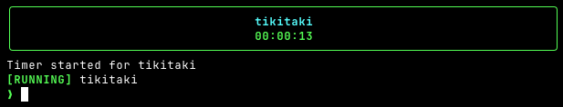

<h1 align="center">
  <br>
  <code>tikitaki</code>
  <br>
  <sub><sup>Track work time without leaving your terminal</sup></sub>
</h1>

<p align="center">
  
  
  
</p>

<p align="center">
  An interactive CLI timer with a REPL-like interface for tracking work time, with Jira and Clockify sync built in.
  <br>
  Type slash commands while a live timer ticks above. No browser, no context switch, no friction.
</p>

<br>

<p align="center">
  
</p>

---

## Features

|                     |                                                                             |
| ------------------- | --------------------------------------------------------------------------- |
| **Live Timer**      | Real-time elapsed counter with pause/resume and accurate pause-gap tracking |
| **Slash Commands**  | REPL-style interface -- type commands while the timer runs                  |
| **History**         | View entries by today, week, month, or specific date with daily hour totals |
| **Manual Log**      | Forgot to start the timer? Log entries after the fact                       |
| **Jira Sync**       | Push worklogs to Jira via REST API with ADF-formatted comments              |
| **Clockify Sync**   | Push time entries to Clockify with project mapping                          |
| **Sync Check**      | Compare local entries against remote worklogs to spot discrepancies         |
| **Auto-Sync**       | Optionally sync on every `/stop`                                            |
| **Daily Alerts**    | Days below your minimum hours target are highlighted in red                 |
| **Command History** | Press up/down arrow keys to recall previous commands                        |

---

## Quick Start

```bash
# Install dependencies
npm install

# Build
npm run build

# Start
npm start
```

Once running, type `/help` to see all commands.

---

## Commands

```
/start <ticket> [desc] [HH:MM]      Start a timer (optional past start time)
/pause                              Pause the current timer
/resume                             Resume a paused timer
/stop                               Stop and save the current timer
/stop:discard                       Stop and discard the current timer

/history                            Show today's entries
/history:week                       Show this week's entries
/history:month                      Show this month's entries
/history <YYYY-MM-DD>               Show entries for a specific date

/log                                Manually log a time entry (interactive)
/log [date] <ticket> <duration>     Quick log; optional date YYYY-MM-DD to backdate (e.g. /log 2025-03-10 XXX-123 1h30m)
/log [date] <ticket> <dur> <from>   With start time
/log [date] <ticket> <dur> <from> <desc> <to>

/remove                             Interactive multi-select to remove entries
/remove <id>                        Remove a time entry (use first 8 chars of ID)
/remove:all                         Remove all time entries

/sync [today|week|month]            Sync unsynced entries to integrations
/sync:pull [today|week|month]       Import entries from integrations
/sync:check [today|week|month]      Compare local vs remote entries
/sync:check --full [period]         Full table of all local/remote entries

/settings                           Open settings menu
/settings:integrations              Configure Jira/Clockify integrations
/settings:projects                  Manage project mappings

/help                               Show this help message
/quit                               Exit the application
```

## Integrations

### Jira

Configure via `/settings:integrations` > Jira. Requires:

- **Base URL** -- e.g. `https://yourorg.atlassian.net`
- **Email** -- your Atlassian account email
- **API Token** -- generate at [id.atlassian.net/manage-profile/security/api-tokens](https://id.atlassian.net/manage-profile/security/api-tokens)

Worklogs are posted to `POST /rest/api/3/issue/{ticket}/worklog` with Basic auth.

### Clockify

Configure via `/settings:integrations` > Clockify. Requires:

- **API Key** -- from [app.clockify.me/user/preferences#advanced](https://app.clockify.me/user/preferences#advanced)
- **Workspace ID** -- from your workspace settings

Project mappings link your ticket prefixes (e.g. `TEST`) to Clockify project IDs.

---

## Data Storage

All data lives in `~/.tikitaki/`:

| File            | Contents                                                             |
| --------------- | -------------------------------------------------------------------- |
| `history.json`  | All time entries with ticket, duration, pause intervals, sync status |
| `settings.json` | Integration credentials, auto-sync toggle, minimum daily hours       |

## Development

```bash
npm run dev          # Start with tsx (hot reload)
npm run build        # Compile TypeScript
npm run lint         # ESLint
npm test             # Vitest (63 tests)
```
